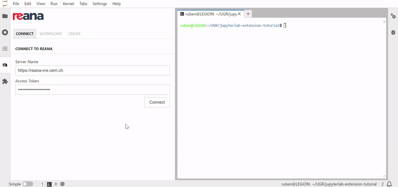

# Reana JupyterLab Extension
[](https://github.com/vre-hub/reana-jupyterlab-extension/actions/workflows/build-and-publish.yml/badge.svg)
[](https://github.com/vre-hub/reana-jupyterlab-extension/actions/workflows/test.yml/badge.svg)
[](https://codecov.io/gh/vre-hub/reana-jupyterlab-extension)
[](https://pypi.org/project/reana-jupyterlab)
[](https://pypi.org/project/reana-jupyterlab)
[](https://vre-hub.github.io/docs/extensions/reana-jupyterlab/)
[](https://doi.org/10.5281/zenodo.13366643)

Reana JupyterLab plugin provides a set of tools to interact with the [Reana](https://reanahub.io/) workflow management system from within JupyterLab. 



## Requirements
- JupyterLab>=4,<5
- Notebook<7
- Node.js==20
- [Custom version of `reana-client`](https://github.com/mdonadoni/reana-client/tree/vre-summer-24)

## Installation guide for users
To install the extension, run the following command:
```bash
pip install reana-jupyterlab
```

In case you want to run the tests, install the extension with the following command:
```bash
pip install reana-jupyterlab[dev]
```

### Docker image
It is possible to run the extension in a Docker container. To download and run the image, use the following commands:
```bash
docker pull ghcr.io/vre-hub/reana-jupyterlab-extension:<version>
docker run -p 8888:8888 ghcr.io/vre-hub/reana-jupyterlab-extension
```

All the available versions can be found [here](https://github.com/vre-hub/reana-jupyterlab-extension/pkgs/container/reana-jupyterlab-extension).
## Installation guide for developers
Install Python dependencies
```bash
python -m pip install -r requirements.txt
```

Install Yarn dependencies
```bash
jlpm install
```

Build the extension
```bash
jlpm run build
```

Install the extension (including the testing dependencies)
```bash
python -m pip install .[dev]
```

Enable the server extension
```bash
jupyter server extension enable --py reana_jupyterlab
```

Finally, open a JupyterLab instance. The extension should be available in the JupyterLab sidebar.
```bash
jupyter lab
```